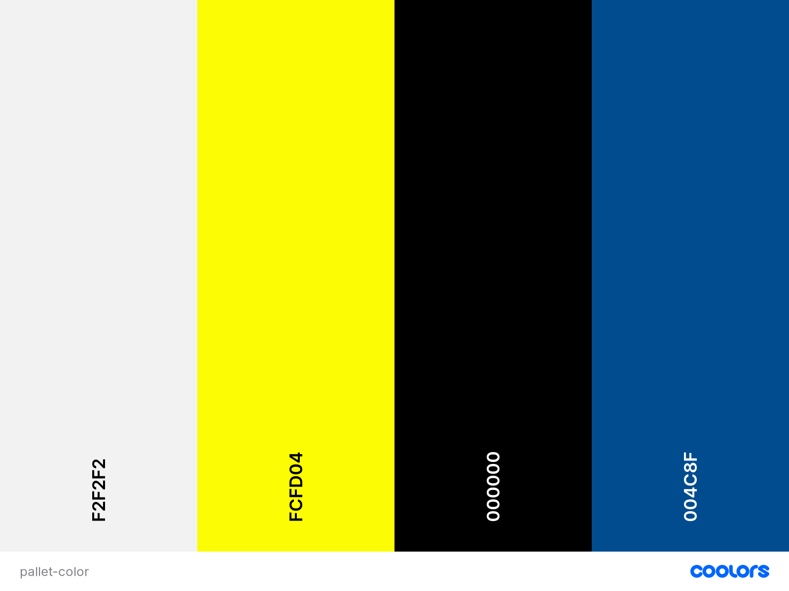

<h1 align="center">My Portfolio</h1>

<h2 align="center">Code Institute - Milestone Project 1</h2>

Hello, this is my portfolio and is the first of four Milestone Projects that make up the Full Stack Web Development Program at the Code Institue. The main requirements were to make a static but responsive website with a minimum of three pages using HTML5 and CSS3.

The project is developed primarily using **HTML** and **CSS**, with a small amount of **JavaScript** implemented for additional functionality.

[View website on GitHub Pages](https://gersondelacruzdeveloper.github.io/Milestone-Project1/).

## Table of contents
1. [**User Experience (UX)**](#User-experience)
     1. [Strategy](#strategy)
     2. [Scope](#scope)
     3. [Structure](#structure)
     4. [Skeleton](#skeleton)
     5. [Surface](#surface)
2. [Features](#features)
     1. [Existing Features](#existing-features)
     2. [Future Feature Considerations](#future-feature-considerations)
3. [**Technologies Used**](#technologies-used)
4. [**Testing**](#testing)
    1. [Performance](#performance)
    2. [HTML Validation](#html-validation)
    3. [CSS Validation](#css-validation)
    4. [Manual Testing](#manual-testing)
    5. [Responsiveness](#responsiveness)
    6. [Tested User Stories](#tested-user-stories)
    7. [Bugs](#bugs)
5. [**Deployment**](#deployment)
    1. [How this Project was Deployed](#how-this-project-was-deployed)
    2.  [How to Run this Project in your Browser](#how-to-run-this-project-in-your-browser)
    3. [How to Run this Project Locally](#how-to-run-this-project-locally)
6. [**Credits**](#credits)
    1. [Content](#content)
    2. [Media](#media)
    3. [Code](#code)
7. [Acknowledgements](#acknowledgements)
8. [Disclaimer](#disclaimer)

      
---
##  User Experience

### Strategy

- The User centred Design process started with the creation of the User Stories.  These influenced subsequent feature, layout, and design decisions.

- The main goal for my portfolio website is to attract new recruiters or potential employers to encourage them to hire me as a developer. 

- The portfolio has been designed to provide minimal, but relevant, content that is easy to access, which satisfies the needs of recruiters or potential employers. 

- Animations have been used extensively throughout the site in order to showcase the results of what I can achieve with my software developing knowledge.

#### User Stories

#### Potential employer
I am an employer looking for software developers: 
- I need to be convinced as to why I should hire this developer. 
- I want to find out about what projects he has done.
- I want to find out what programming languages he knows.
- I want to find out if can contact him.
- I want to find out if he has a printable CV. 
- I want to find out if he is currently available.
- I want to find out what skills does he has.
- I want to find out if he has any experience in software development.
- I want to find out what type of developer he is e.g., frontend, backend, full-stack developer.
- I want to find out if he has a GitHub page.
- I want to find out if he has a LinkedIn page.
- I want to find out if I can contact him directly to his number.

#### Portfolio owner
I am the portfolio owner:
-	I want to encourage more recruiters and potential employers to contact me.
-	I want to clearly display information about what I do, my skills, and programming languages I know.
-	I want recruiters and potential employers to view if I am currently available.
-	I want recruiters and potential employers to view my LinkedIn page.
-	I want recruiters and potential employers to be able to contact me easily.
-	I want recruiters to be able to print my CV.
- I want recruiters and potential employers to view my GitHub page.
-	I want to showcase all the projects I have done, which will give then confident of what realistically I can do.

###  Scope

The key features of the portfolio were developed based on the employers or recruiters needs. 
Employers or recruiters should be able to do the following on the portfolio.
- View my photo, my name and what I do
- Print my CV
- Be able to go to my GitHub profile
- Be able to go to my LinkedIn profile
- Send me a message directly with WhatsApp
- Be able to view my knowledge level in Software development
- Be able to view my work experience
- Be able to view the projects I have done
- Contact me for any enquiries for future employments

### Structure

After identifying what the recruiters and potential employers are looking for in a portfolio the following features were chosen:

- A nice paragraph with my name, image and what I do.
-	Progress bar loading my knowledge level in software development 
-	Bullets points showcasing my experiences
-	Different projects that when hover one show info about the project
-	WhatsApp links
-	GitHub links
-	LinkedIn links 
-	Printable CV
-	Sign Up form
-	Portfolio logo
For ease of navigation, it was decided to opt for a multi-page site, grouped into 5 pages: Home, Skills, Experience, Projects, and Contact.

### Skeleton

The UI wireframing tool, [Balsamiq](https://balsamiq.com/), was used to create wireframes for each site page as it would appear on desktop, tablet and mobile devices.

The main content areas were expressed in similar ways to create consistency across the site.

A title and motivational heading were included at the top of each page.
To help recruiters and potential employers, navigate through the site efficiently a fixed navbar was decided upon for desktop viewers. The smaller, neater 'hamburger' icon with accompanying dropdown menu was chosen to provide mobile and tablet users with a less cluttered screen and therefore, a more pleasant browsing experience.
A footer, which contains very important information: copy right, link of printable CV, LinkedIn link, GitHub link, and WhatsApp link, all of these were included at the bottom of every page.

 

#### Wireframes

##### Desktop
- [Home page for Desktop](./assets/documentation/wireframes/Home.png)

- [Skills page for Desktop](./assets/documentation/wireframes/Skills.png)

- [Experience page for Desktop](./assets/documentation/wireframes/Experience.png)

- [Project page for Desktop](./assets/documentation/wireframes/Projects.png)

- [Contact page for Desktop](./assets/documentation/wireframes/Contact.png)

##### Tablet
- [Home page for Tablet](./assets/documentation/wireframes/home-tablet.png)

- [Skills page for Tablet](./assets/documentation/wireframes/skills-tablet.png)

- [Experience page for Tablet](./assets/documentation/wireframes/experience-tablet.png)

- [Project page for Tablet](./assets/documentation/wireframes/project-tablet.png)

- [Contact page for Tablet](./assets/documentation/wireframes/contact-tablet.png)

##### Mobile
- [Home page for Mobile](./assets/documentation/wireframes/home-mobile.png)

- [Skills page for Mobile](./assets/documentation/wireframes/skills-mobile.png)

- [Experience page for Mobile](./assets/documentation/wireframes/experience-mobile.png)

- [Project page for Mobile](./assets/documentation/wireframes/project-mobile.png)

- [Contact page for Mobile](./assets/documentation/wireframes/contact-mobile.png)

 

### Surface

##### Desing
The purpose of the site is aligned with the design: colour, positioning of the menu, animation, and Brading of myself, which is simple, effective, and powerful.

##### Logo
The logo was a simple made with CSS by my own, colours, fonts, and spacing was experimented and tried several times in order to achieve a colour scheme that suit the entire design also it has a squire circulating around infinite with the meaning of all the time working.

##### Colour Scheme

The colour scheme was chosen in order to convey a simple, clean and visually appealing site: Dark blue is associated with depth, expertise, and stability. Gold is the color of wealth and luxury. 
The color black represents strength, seriousness, power, and authority.

*Colour palette created at* [coolors.co](https://coolors.co/ffbe0b-fb5607-ff006e-8338ec-3a86ff).

